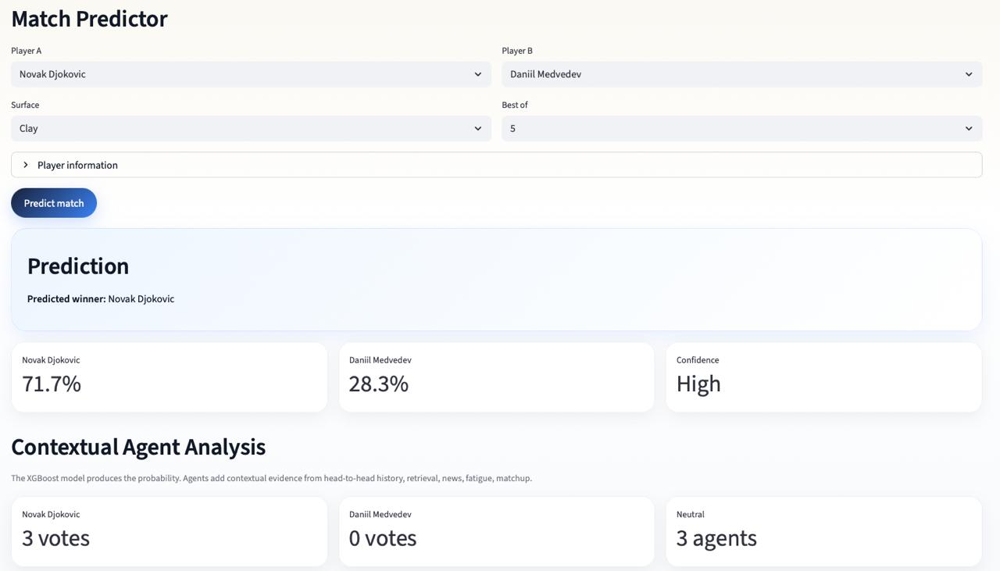
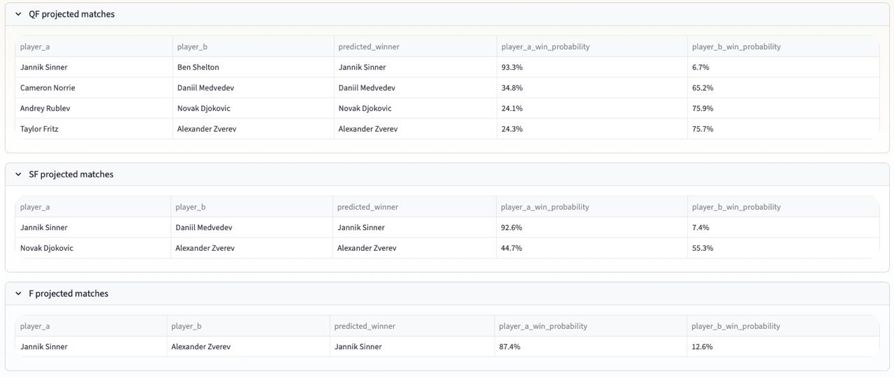

CourtSense AI

Machine learning system for tennis match prediction and tournament simulation, combining Elo ratings, historical retrieval, and agent-based analysis.

⸻

Demo

### Match Predictor

### Roland-Garros 2026 Simulation

⸻

Overview

CourtSense AI predicts ATP tennis matches using:

* XGBoost classification
* Dynamic Elo ratings
* Surface-specific player strength
* Historical match retrieval
* Head-to-head analysis
* Contextual agents
* Roland-Garros tournament simulation

The project combines statistical prediction with interpretable reasoning layers.

⸻

Main Features

Match Prediction

Predicts:

* match winner probability
* confidence level
* contextual analysis

using:

* ATP rankings
* ranking points
* Elo ratings
* surface-specific Elo
* recent form
* fatigue indicators
* serve/return profile

⸻

Roland-Garros Simulation

Uses the official Roland-Garros draw to simulate:

* projected winners
* round progression
* tournament champion

⸻

Retrieval System

Retrieves historically similar matches using:

* cosine similarity
* normalized feature vectors
* contextual match-state similarity

⸻

Agent-Based Analysis

Specialized agents analyze:

* head-to-head history
* fatigue
* matchup dynamics
* similar historical matches
* news context
* uncertainty risk

The final prediction combines:

* ML probability
* contextual evidence
* agent reasoning

⸻

Model Architecture

Historical ATP data
        ↓
Feature engineering
        ↓
Elo computation
        ↓
XGBoost prediction
        ↓
Historical retrieval
        ↓
Agent analysis
        ↓
Final judgement

⸻

Core Features Used by XGBoost

* overall_elo_diff
* surface_elo_diff
* rank_diff
* rank_points_diff
* recent_win_rate_diff
* age_diff
* surface encoding
* best-of format

⸻

Elo System

The project maintains:

* overall Elo
* clay Elo
* hard Elo
* grass Elo

Each rating is updated dynamically from historical ATP matches.

⸻

Project Structure

courtsense-ai/
│
├── app/
│   └── streamlit_app.py
│
├── src/
│   ├── agents.py
│   ├── draw_loader.py
│   ├── elo.py
│   ├── explainability.py
│   ├── features.py
│   ├── head_to_head.py
│   ├── model.py
│   ├── news_context.py
│   ├── player_stats.py
│   ├── predict.py
│   ├── retrieval.py
│   └── tournament_simulator.py
│
├── data/
│
├── model.pkl
│
└── README.md

⸻

Local Run

Install dependencies:

pip install -r requirements.txt

Run the application:

streamlit run app/streamlit_app.py

⸻

Future Improvements
* bookmaker odds integration
* richer retrieval system
* improved fatigue modeling
* probabilistic bracket simulation

⸻

Author

Built by Georgii Melidi · 2026